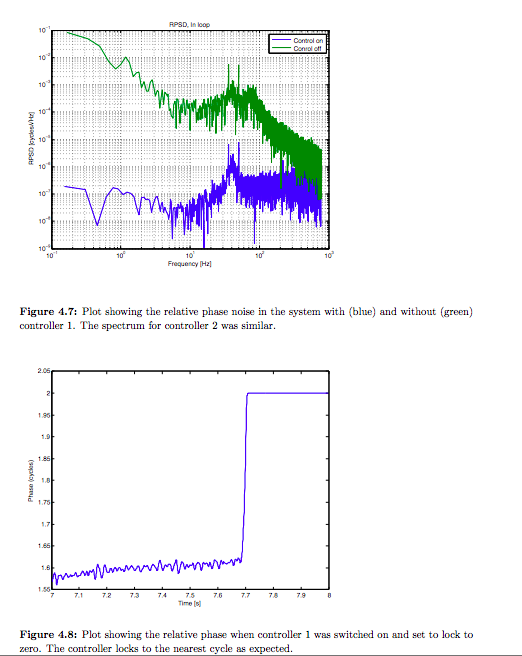
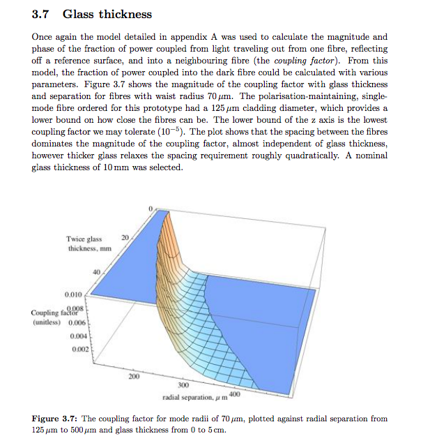
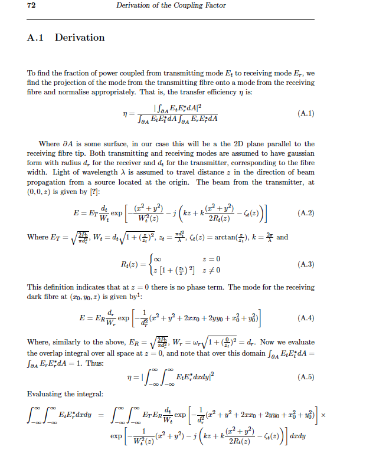
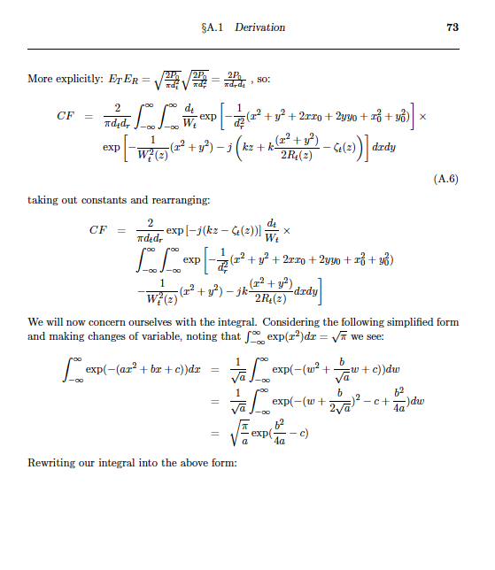

# Thesis
Thesis for Honours year at ANU,
in which a new configuration for an optical phased array (real world death-star) was experimentally demonstrated.

This resulted in [this](https://opg.optica.org/ao/abstract.cfm?uri=ao-53-22-4881) publication.

Includes: 

## (1-2) Background Theory
Introduction theory, about optical phased arrays, and motivation.
## 3 Optical Head Design
Derivation and calculation (analytical and numerical) of coupling factor for external cover component of configuration.
## 4 Controller Design
Design of digital controller/noise suppression algorithm with reference to conventional control theory methods.
## 5 CDMA-based Digital Interferometry
Description of innovation involving new method for extracting phase signal using coded dithering.
## 6 Experimental Setup and Results
Successful noise cancellation.

## Appendices
- more detailed calculations and code.

# Exerpts
Sample calculation and use of model:

